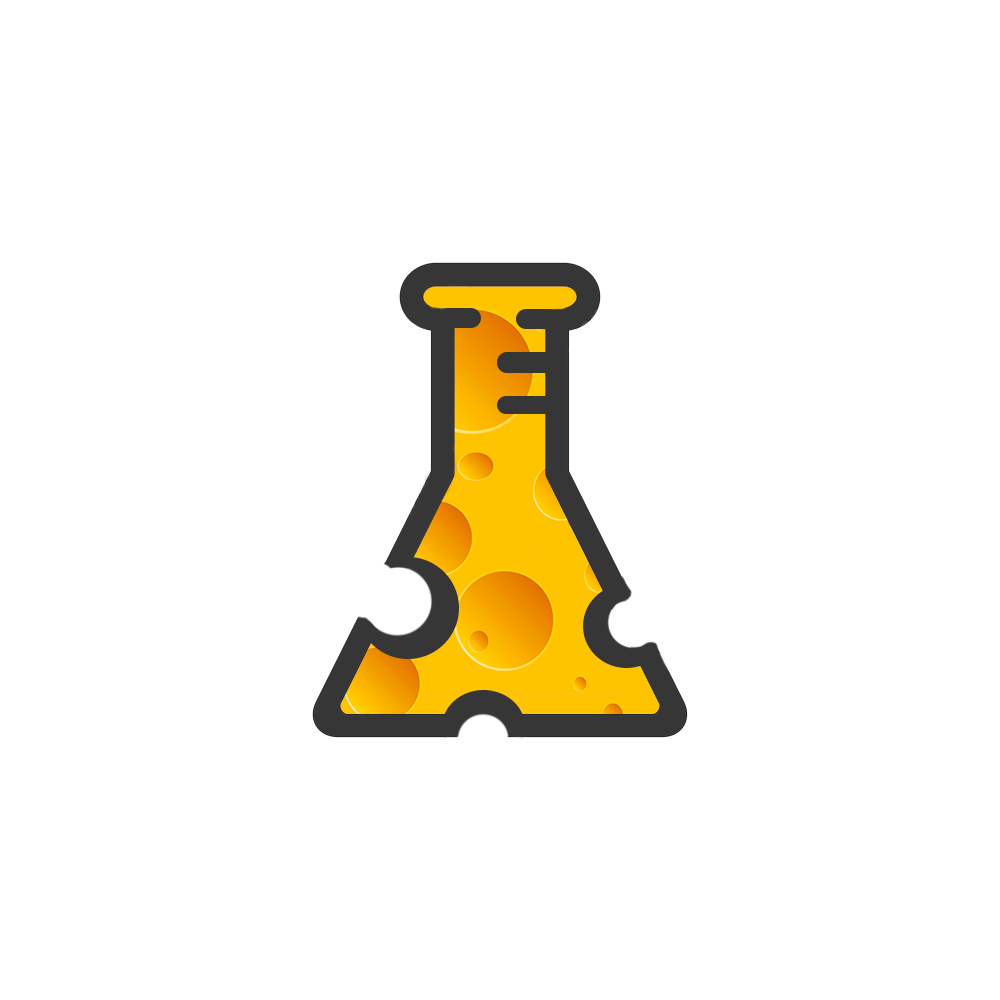
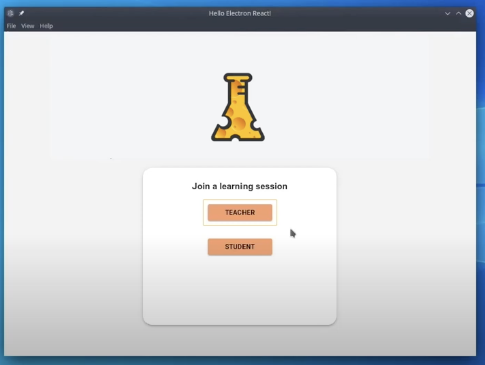
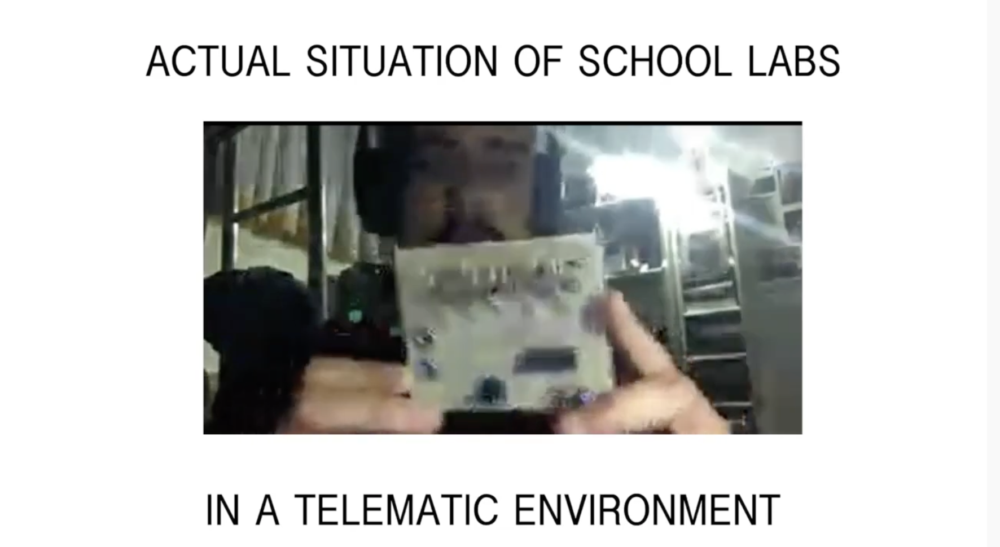

# MiceLabs

 
## Team

[

## IDEA

an online collaboration platform that It allows teacher to organize active labs for all STEM class. The teacher can choose an online laboratory (simulator) among those suggested by our platform or any website .
MiceLab, impacts the way students interact with teachers: students will ask more questions because they will have the possibility to apply what they learn and find gaps in their knowledge without expensive labs and in any conditions.

### Budget

The development of our platform will take 4 months, the total cost of the project will be approximately 10400 € for development and 4000 € divided into servers (only to synchronize customers) and tests.
Another approach will be to develop the platform ourselves without any development cost and will be maintained 4000 € for testing and operating costs

## Market

Our main reference markets are teachers at high schools and universities of STEM subjects. The academic program is the same types of schools. This makes it easy for us to select ad-hoc laboratories and reuse them across schools of the same type.

Our platform is not only for schools. It can also be used by businesses to teach groups of employees how to use online software.
